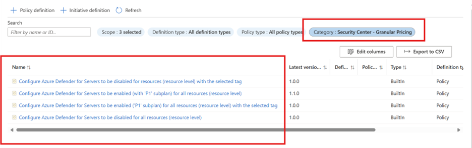
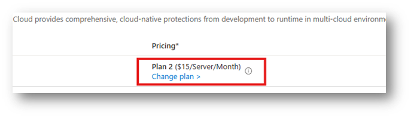
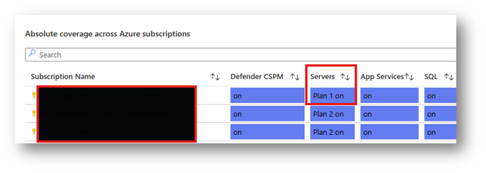
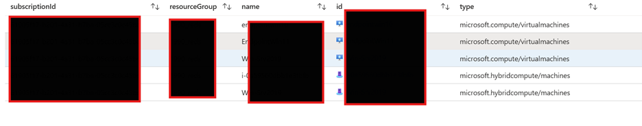
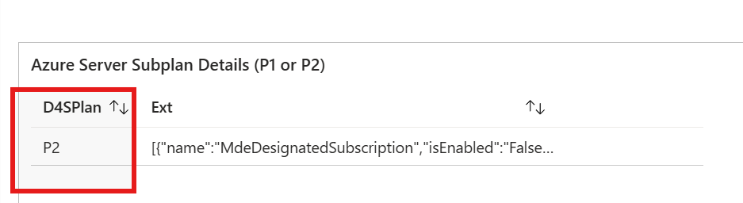

# Resource Configuration Guidance for Upgrading / Downgrading Server Protection Plans
Have you ever needed to upgrade Defender for Server protection from P1 to P2 in Azure for a specific feature or compliance need, like the 500MB Log Analytics benefit, Azure Update Manager, or File Integrity Monitoring? I recently discovered while reviewing this with a customer that these requirements are often missed, especially if another team handled enrollment.

## Deployment Mechanism:
Defender for Servers can be deployed through several methods, including the Defender for Cloud Portal, REST API, Infrastructure as Code, or by assigning an Initiative or Policy to a Management Group, Subscription, Resource Group, or via a third-party device management system. The preferred and simplest way to enroll a server in the protection service is through the [Defender for Cloud portal](https://learn.microsoft.com/en-us/azure/defender-for-cloud/tutorial-enable-servers-plan#enable-on-azure-aws-or-gcp), where administrators choose Plan 1 or Plan 2 at the subscription level. This method works best for new deployments; however, you must validate if there are any existing Azure Policy assignments to avoid conflicts when selecting a plan – especially during upgrades.

## Observation:
After the administrator selects the plan, the Defender for Cloud Environment Setting blade will automatically show the applied protection which can be assumed that all servers will be enrolled into that protection after the configuration is set and subsequently pushed. Well, that is not the case in some instances. You must ensure there are no other conflicting Azure Policies that were enforcing Plan 1 at the resource level. In my example, this Azure Policy had an assignment: [Configure Azure Defender for Servers to be enabled ('P1' subplan) .....](https://www.azadvertizer.net/azpolicyadvertizer/9e4879d9-c2a0-4e40-8017-1a5a5327c843.html) you will find it will override the P2 Defender for Cloud portal subscription level enforcement. The policy itself will set a configuration at the resource level to enforce the billing and until you delete that configuration on that server, the server will be unable to recognize that P2 needs to be enforced. This holds true for any Policy labeled with “Security Center – Granular Pricing”: 

  

I identified the differences by utilizing this [workbook](https://techcommunity.microsoft.com/blog/microsoftdefendercloudblog/how-to-keep-track-of-defender-for-cloud-coverage/3932602) to compare, server-by-server, which pricing object was set on the server itself. I noticed a discrepancy in what was being shown between the coverage workbook (out-of-the-box report in the Workbooks blade) and my expected outcome of P2 server protection in the Environment settings. Relying solely on the subscription-level plan settings may not fully reflect the actual protection level of a resource.  As an example:

### Defender for Cloud Environment Settings Blade:

  

### Coverage Workbook in the Workbook blade:

  

The coverage workbook in this case is reading the pricing objects that are assigned to the servers itself. If the query finds one that conflicts with the Plan pricing on the Environment Settings blade it will show the lowest applied server protection (in this case P1). On the other hand, the first screenshot shows the Environment Settings page where the expectation is that all servers would be applied the P2 protection. 

We recommend following the steps published in [Deploy Defender for Servers in Microsoft Defender for Cloud - Microsoft Defender for Cloud | Microsoft Learn](https://learn.microsoft.com/en-us/azure/defender-for-cloud/tutorial-enable-servers-plan?source=recommendations#remove-the-resource-level-configuration-using-the-rest-api). If you intend to upgrade or downgrade, begin by removing the configuration from each server. Additionally, the link below directs you to a workbook that enables you to review the subplan for each server and initiate a REST call to delete individual server configurations, which can be particularly useful when testing a subset of servers. Check that out here: [DFC Delete Servers Plan Server Configuration](https://github.com/SaggiehaimBlog/MicrosoftSecurity/blob/69a5a9c6d7b68f89f1dda56e9bc8d67072aefcb5/workbooks/DFC%20Servers%20Plan%202%20Server%20Configuration/Delete%20Server%20Configuration.json)

  

  

To scale this across all servers in a subscription, develop and run a PowerShell script at the tenant, subscription, or resource group level. Use caution with the DELETE resource calls for Arc and Azure servers, as their "resource type" values differ:
  - Azure VM:
      - /subscriptions/{subscriptionId}/resourceGroups/{VMresourceGroup}/providers/Microsoft.Compute/virtualMachines/{VMname}/providers/Microsoft.Security/pricings/virtualMachines?api-version=2024-01-01
  - Azure Arc VM:
      - /subscriptions/{subscriptionId}/resourceGroups/{VMresourceGroup}/providers/Microsoft.Hybridcompute/Machines/{VMname}/providers/Microsoft.Security/pricings/virtualMachines?api-version=2024-01-01

Feel free to reference this script written by Mike Huffmyer (Github alias: mhuffymer) which will help with a more automated scalable solution: [DeleteScriptResourceLevelServers/README.md at main · mlopinto/DeleteScriptResourceLevelServers.](https://github.com/mlopinto/DeleteScriptResourceLevelServers/blob/main/README.md) Please note this will require adequate testing within your own tenant. 

## Conclusion:

Before you move protection plans, make sure you fully review how the protection is being applied whether that be a custom template or policy or the OOTB deployment process. Be sure to review how the enforcement of the servers is instantiated, especially if it was something you inherited from another resource or just following standard operating procedures. In some cases, Azure Policy may cause conflicts if you have a mature resource level tagging methodology / enforcement or you are applying granular plans to certain business critical servers.
